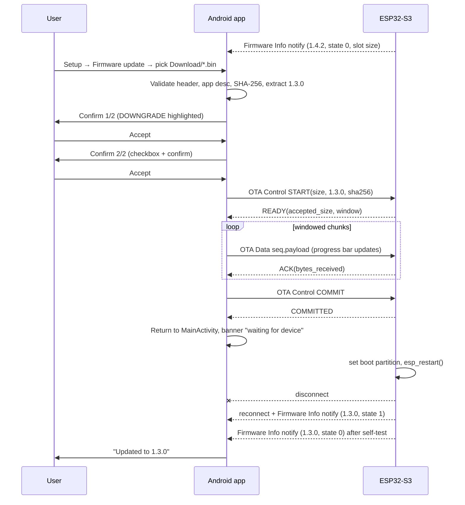

# OTA over BLE — Design

Adds firmware update over BLE, driven from the Android app, to the existing
Android (`com.pioneermediabridge`) ↔ ESP32-S3 (`esp32s3/main/ble_endpoint.c`) bridge.

## 1. Goals

1. ESP32 reports its **active firmware version** to Android on every connection.
   Absent/unparsable version is treated as `0.0.0`.
2. OTA image is picked from the Android **Download** directory.
3. OTA is started from the Android **Setup** page.
4. Android **validates the image locally** before contacting the device.
5. Android extracts the image version, compares with the device version using
   **semantic versioning**, and requires **two separate confirmations**, with a
   downgrade explicitly highlighted.
6. Transfer is initiated by a **BLE command** from Android to the ESP32.
7. Android shows a **progress bar** based on bytes sent / image size.
8. On completion Android **returns to the main screen**, expects the ESP32 to
   reboot, disconnect, reconnect, and report the **new active version**.

## 2. GATT additions

Existing bridge service `A1234567-1234-1234-1234-A12345678901` gains three
characteristics. UUIDs continue the existing low-byte derivation scheme, so the
ESP32 keeps deriving them from `CONFIG_ZAFIRA_BLE_PROFILE_UUID`.

| Char | UUID low byte | Properties | Direction |
|---|---|---|---|
| Firmware Info | `…0905` | Read, Notify | ESP32 → Android |
| OTA Control | `…0906` | Write (with response), Notify | bidirectional |
| OTA Data | `…0907` | Write Without Response | Android → ESP32 |

All existing characteristics are unchanged.

### 2.1 Firmware Info (`…0905`)

Read value and notification payload, 12 bytes, little-endian:

| Offset | Size | Field |
|---|---|---|
| 0 | 1 | `major` |
| 1 | 1 | `minor` |
| 2 | 1 | `patch` |
| 3 | 1 | State: `0` running/validated, `1` pending verify (rollback armed) |
| 4 | 4 | `ota_slot_size` — usable bytes of the inactive OTA partition |
| 8 | 4 | `max_chunk` — max OTA Data payload bytes the device accepts |

The ESP32 populates version from `esp_app_get_description()->version`. If the
string is not `MAJOR.MINOR.PATCH[-prerelease][+build]`, the version becomes
`0.0.0`. Pre-release/build metadata is not transported; it is only used by
Android for the local image (see §4.3).

Notification is sent once the central subscribes to the CCCD after connect, and
again whenever the state changes (e.g. after post-OTA self-test validation).
Android also performs an explicit read after service discovery, so version
discovery does not depend on notification timing.

### 2.2 OTA Control (`…0906`)

Android → ESP32 commands (Write With Response):

| Opcode | Payload | Meaning |
|---|---|---|
| `0x01` START | `u32 image_size`, `u8 major/minor/patch`, `32 B sha256` | Begin OTA |
| `0x02` ABORT | — | Cancel and erase staging state |
| `0x03` COMMIT | — | Verify hash, set boot partition, reboot |

ESP32 → Android status notifications:

| Byte 0 | Name | Payload |
|---|---|---|
| `0x80` | READY | `u32 accepted_size`, `u16 window_chunks` |
| `0x81` | ACK | `u32 bytes_received` |
| `0x82` | COMMITTED | — (sent immediately before reboot) |
| `0xEF` | ERROR | `u8 reason` |

Error reasons: `1` busy, `2` image too large, `3` bad chunk sequence,
`4` flash write failure, `5` hash mismatch, `6` invalid image header,
`7` timeout, `8` not permitted (no active session).

### 2.3 OTA Data (`…0907`)

Write Without Response, framed as:

| Offset | Size | Field |
|---|---|---|
| 0 | 2 | `seq` — chunk index, starts at 0, wraps at 65536 |
| 2 | n | payload bytes |

`n` ≤ `max_chunk` from Firmware Info. The device rejects out-of-order `seq`
with ERROR `3`; Android must then ABORT and restart the transfer.

### 2.4 Flow control and throughput

- ATT MTU is raised for OTA: ESP32 preferred MTU becomes **517**; Android keeps
  requesting the larger MTU and clamps all *existing* media/time payloads to the
  current 128-byte limits, so the media contract is unchanged.
- `max_chunk = negotiated_mtu - 3 (ATT header) - 2 (seq)`.
- The device sends an ACK every `window_chunks` chunks (default 16). Android
  will not queue more than `window_chunks` unacked writes. This is the backpressure
  mechanism; `WRITE_SETTLE_MS` is not applied on the OTA Data path.
- Android requests a low-latency connection interval
  (`CONNECTION_PRIORITY_HIGH`) for the duration of the transfer and restores
  balanced priority afterwards.
- Media and time-sync writes are **suspended** while an OTA session is active.

## 3. ESP32 changes

### 3.1 Partition table (applied)

The project previously used `CONFIG_PARTITION_TABLE_SINGLE_APP` with the
inherited default `CONFIG_ESPTOOLPY_FLASHSIZE="2MB"`, in which OTA is
impossible. `esptool.py flash_id` reports **4 MB** on the actual module, so the
flash size is corrected and a custom two-slot table is used.

`esp32s3/partitions.csv` (app partitions must be 64 KB aligned):

```
# Name,   Type, SubType, Offset,   Size
nvs,      data, nvs,     0x9000,   0x5000
otadata,  data, ota,     0xe000,   0x2000
ota_0,    app,  ota_0,   0x10000,  0x180000
ota_1,    app,  ota_1,   0x190000, 0x180000
```

Each slot is 1.5 MB against a current image of 482,176 B (471 KB, 31% used),
leaving 960 KB of the 4 MB unallocated for a future data partition.

Corresponding `sdkconfig.defaults` entries:

```
CONFIG_ESPTOOLPY_FLASHSIZE_4MB=y
CONFIG_ESPTOOLPY_FLASHSIZE="4MB"
CONFIG_PARTITION_TABLE_CUSTOM=y
CONFIG_PARTITION_TABLE_CUSTOM_FILENAME="partitions.csv"
CONFIG_BOOTLOADER_APP_ROLLBACK_ENABLE=y
CONFIG_APP_PROJECT_VER_FROM_CONFIG=y
CONFIG_APP_PROJECT_VER="0.0.0"
```

`sdkconfig.defaults` also now carries the previously sdkconfig-only values for
the BLE device name and the display SDA/SCL/MRQ GPIOs (9/8/7), so regenerating
`sdkconfig` no longer silently reverts them to the Kconfig defaults (5/6/7).

**One-off wired update.** The new table moves the app and resizes NVS, so the
stored BLE bonds are invalidated. Flash once over serial with a full erase and
re-pair the phone:

```
idf.py -p <PORT> erase-flash
idf.py -p <PORT> flash monitor
```

`ota_0` is the boot slot after this flash; all subsequent updates go over BLE.

### 3.2 New module `esp32s3/main/ota_service.c`

Owns the OTA state machine, keeping `ble_endpoint.c` limited to GATT plumbing.

States: `IDLE → RECEIVING → VERIFYING → COMMITTED`.

- **START**: reject if a session exists (`busy`) or `image_size >
  ota_slot_size` (`image too large`). Otherwise `esp_ota_get_next_update_partition()`,
  `esp_ota_begin(part, image_size, &handle)`, reset SHA-256 context and counters,
  notify READY.
- **Data chunk**: validate `seq == expected`, `esp_ota_write()`, feed the
  `mbedtls` SHA-256 context, increment counters, notify ACK on the window
  boundary. Chunks are handed to a dedicated FreeRTOS OTA task through a queue,
  never written from the NimBLE host callback.
- **COMMIT**: `esp_ota_end()` (which validates the image header/checksum),
  compare the computed SHA-256 against the one from START, then
  `esp_ota_set_boot_partition()`, notify COMMITTED, wait ~200 ms for the
  notification to flush, `esp_restart()`.
- **ABORT**, GATT disconnect, or a 30 s inactivity timeout: `esp_ota_abort()`
  and return to `IDLE`.

The existing display/media task is left running but media messages are ignored
while `RECEIVING`, to avoid competing for the flash and radio.

### 3.3 Rollback

After reboot the new image starts in `ESP_OTA_IMG_PENDING_VERIFY`, so Firmware
Info reports state `1`. Self-test = NimBLE host started, service registered, and
one successful central connection. On success the app calls
`esp_ota_mark_app_valid_cancel_rollback()` and notifies Firmware Info with state
`0`. If the device resets before that, the bootloader reverts to the previous
slot automatically.

## 4. Android changes

### 4.1 New files

| File | Role |
|---|---|
| `ble/OtaConstants.kt` | UUIDs, opcodes, window size, timeouts |
| `ble/EspImageValidator.kt` | Local image parsing/validation, version extraction |
| `ble/SemVer.kt` | Parse + compare, `0.0.0` fallback |
| `ble/OtaTransferManager.kt` | OTA session state machine over `BleWriterManager`'s GATT |
| `ui/FirmwareUpdateViewModel.kt` | Setup-page state: image list, validation, progress |
| `ui/OtaProgressActivity.kt` (or a Setup dialog) | Progress bar UI |

`BleWriterManager` gains: read/subscribe of Firmware Info, exposure of the
`BluetoothGatt` to `OtaTransferManager`, a `suspendUserTraffic` flag, and an
`activeFirmwareVersion: StateFlow<SemVer?>`.

### 4.2 Image discovery

`MANAGE_EXTERNAL_STORAGE` is already requested, so the primary path lists
`Environment.getExternalStoragePublicDirectory(DIRECTORY_DOWNLOADS)` for
`*.bin`, newest first. If the permission is not granted, fall back to
`ACTION_OPEN_DOCUMENT` with `EXTRA_INITIAL_URI` pointing at Downloads; the
resulting content URI is read through `ContentResolver`. No file outside the
user's explicit selection is read.

### 4.3 Local validation (before any BLE contact)

`EspImageValidator` rejects the image unless **all** of the following hold:

1. Size ≥ 1 KB and ≤ device `ota_slot_size` (device value known from Firmware
   Info; if the device is not connected, validation still runs and the size
   check is deferred to START).
2. Byte 0 == `0xE9` (`esp_image_header_t.magic`).
3. `chip_id` (offset 12, u16 LE) == `9` (ESP32-S3).
4. `esp_app_desc_t` at offset `0x20` has magic `0xABCD5432` (u32 LE).
5. `project_name` (offset `0x30` of the descriptor, 32 bytes, NUL-padded)
   matches the expected project name `zafira_ble_endpoint`.
6. `version` (offset `0x10` of the descriptor, 32 bytes) parses as semver; if it
   does not, the image is treated as `0.0.0` and flagged as "unversioned".
7. The trailing 32-byte SHA-256 appended by the IDF build matches the SHA-256 of
   everything preceding it (present when `CONFIG_SECURE_SIGNED_APP` is off but
   `hash_appended` is set in the header).

The SHA-256 computed here is also the value sent in the START command, so the
device verifies exactly the bytes Android validated.

### 4.4 Confirmation flow (two acceptances)

Comparison uses `SemVer.compareTo` (major, minor, patch; pre-release ranks below
the equal release version).

Dialog 1 — summary:

```
Current device firmware : 1.4.2
Selected image          : 1.3.0   ← DOWNGRADE
File                    : zafira-1.3.0.bin (471 KB)
```

Downgrade or same-version cases render the banner in the error colour with an
explicit "This is a DOWNGRADE" / "This is the same version" line. Button label
matches the case ("Downgrade", "Reinstall", "Update"). Cancel is the default.

Dialog 2 — final confirmation: restates target version and the downgrade
warning, and requires the user to check "I understand the device will reboot"
before the confirm button enables. Only after this second acceptance does the
app write the START command.

### 4.5 Transfer and progress

`OtaTransferManager` runs a coroutine state machine:

`IDLE → STARTING (START written) → READY → SENDING → COMMITTING → REBOOTING`

Progress is `bytesAcked / imageSize`, surfaced as a `StateFlow<OtaProgress>`
holding percent, bytes, throughput, and elapsed time. The progress screen keeps
the screen on, shows a determinate `LinearProgressIndicator`, and offers Cancel
(sends ABORT).

Failure handling: any ERROR notification, GATT disconnect while `SENDING`, or a
15 s ACK timeout aborts the session, restores media/time traffic, and shows the
reason. No partial state is retained; a retry restarts from chunk 0.

### 4.6 Post-transfer behaviour

After the COMMITTED notification (or an immediate disconnect following COMMIT,
which is treated as success):

1. `OtaTransferManager` enters `REBOOTING` and shows "Rebooting device…".
2. The progress screen finishes and the app **returns to `MainActivity`**, its
   default screen, with a status banner "Firmware update sent — waiting for
   device".
3. `BleWriterManager` uses its normal reconnect path (5 s backoff) — no special
   casing beyond suppressing the "connection lost" error toast for 60 s.
4. On reconnect, Android reads/receives Firmware Info and updates
   `activeFirmwareVersion`.
5. The banner resolves to one of:
   - **Success**: reported version == the version that was sent. Media/time
     traffic resumes normally.
   - **Rolled back / mismatch**: reported version differs (typically the old
     version, meaning the bootloader rolled back). Banner shows both versions
     and offers "Try again".
   - **Timeout**: no reconnect within 120 s → "Device did not come back online".
6. If the reconnect reports state `1` (pending verify), the banner stays as
   "Verifying…" until the device notifies state `0`.

## 5. Sequence



## 6. Security considerations

- The image is not signed. Anyone able to pair with the device can flash it.
  The GATT server already requires an encrypted, bonded link; OTA Control and
  OTA Data must additionally carry `BLE_GATT_CHR_F_WRITE_ENC |
  BLE_GATT_CHR_F_WRITE_AUTHEN` so an unbonded central cannot start a session.
- Enabling ESP-IDF **Secure Boot v2** and signed app verification is the correct
  long-term control; the SHA-256 exchanged in START only protects against
  corruption, not against a malicious sender.
- Android reads only the file the user selected; no arbitrary path from settings
  is used, avoiding path traversal through the Setup page.
- Rollback protection (`CONFIG_BOOTLOADER_APP_ROLLBACK_ENABLE`) prevents a
  corrupt-but-well-hashed image from bricking the unit.

## 7. Follow-on documentation updates

- `docs/BLE Protocol Contract.md`: add §"Firmware Info" and §"OTA transfer",
  and note the MTU change to 517.
- `android/Design.md`: add the Setup-page firmware update flow and the new
  Android classes.
- `esp32s3/README.md`: document the partition table change and that flashing
  over serial once is required to move from the single-app layout.
