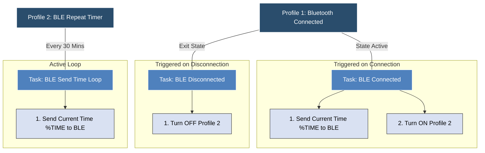

```mermaid

graph TD
    %% Profiles (Triggers)
    P1[Profile 1: Bluetooth Connected] ---|State Active| T1[Task: BLE Connected]
    P1 ---|Exit State| T3[Task: BLE Disconnected]

    P2[Profile 2: BLE Repeat Timer] ---|Every 30 Mins| T2[Task: BLE Send Time Loop]

    %% Task Actions and Connections
    subgraph Triggered on Connection
        T1 --> A1[1. Send Current Time %TIME to BLE]
        T1 --> A2[2. Turn ON Profile 2]
    end

    subgraph Triggered on Disconnection
        T3 --> A4[1. Turn OFF Profile 2]
    end

    subgraph Active Loop
        T2 --> A3[1. Send Current Time %TIME to BLE]
    end

    %% Styles
    classDef profile fill:#2a4d6c,stroke:#fff,stroke-width:2px,color:#fff;
    classDef task fill:#4f81bd,stroke:#fff,stroke-width:1px,color:#fff;
    classDef action fill:#d9e1f2,stroke:#333,stroke-width:1px,color:#000;

    class P1,P2 profile;
    class T1,T2,T3 task;
    class A1,A2,A3,A4 action;
```