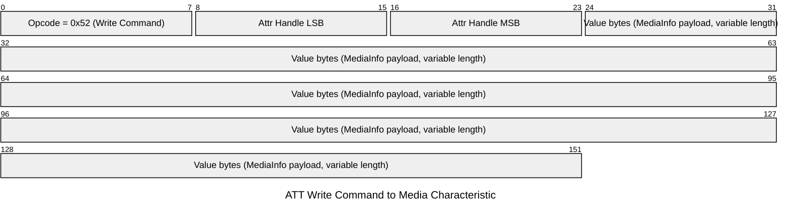
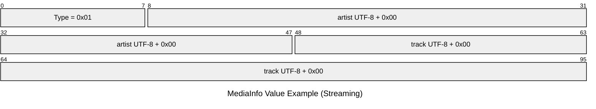
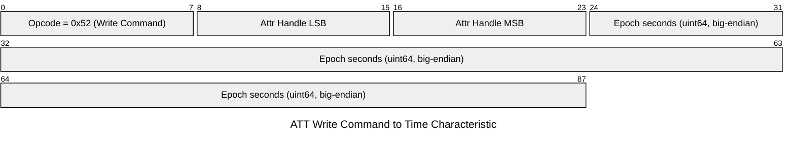

# Android <-> ESP32-S3 Packet Exchange

This document describes the BLE frames exchanged between the Android app and the ESP32-S3 app, using Mermaid packet diagrams.

## Transport and Direction

- Direction: Android app -> ESP32-S3 GATT server
- ATT operation: Write Command (no response), opcode 0x52
- Characteristics:
  - Media: A1234567-1234-1234-1234-A12345678902
  - Time: A1234567-1234-1234-1234-A12345678903

## Frame 1: ATT Write Command (Media characteristic)

This is the BLE ATT frame that carries media payload bytes.

### Media value payload format

First byte is the media type, followed by UTF-8 strings terminated by 0x00.

- 0x00: Radio -> stationId\0
- 0x01: Streaming -> artist\0track\0
- 0x02: CallOutgoing -> number\0name\0
- 0x03: CallIncoming -> number\0name\0
- 0xFF: Idle (single byte)

Example (Streaming):

## Frame 2: ATT Write Command (Time characteristic)

This is sent as an 8-byte big-endian Unix epoch seconds value.

## When Packets Are Sent

### Media frame timing

- Sent whenever parsed media state changes.
- Duplicate consecutive states are suppressed before sending.

### Time frame timing

- Sent immediately when BLE is READY (after service/characteristic discovery).
- Re-sent every 30 minutes.

### Write pacing

- Writes are serialized through a queue.
- A 50 ms settle gap is applied between writes.
- Write type is no-response.

## Source of Information

The diagrams and timing rules above are derived from these implementation points:

- Media payload serialization:
  - android/app/src/main/java/com/pioneermediabridge/model/MediaInfo.kt
  - MediaInfo.toBytes()

- Time payload serialization and periodic scheduling:
  - android/app/src/main/java/com/pioneermediabridge/ble/BleWriterManager.kt
  - BleWriterManager.sendTimeNow()
  - BleWriterManager.onReady()

- BLE write mode and queue behavior:
  - android/app/src/main/java/com/pioneermediabridge/ble/BleWriterManager.kt
  - drainQueue(), onCharacteristicWrite()

- Timing constants:
  - android/app/src/main/java/com/pioneermediabridge/ble/BleConstants.kt
  - TIME_SYNC_INTERVAL_MS, WRITE_SETTLE_MS

- Media send trigger and dedupe:
  - android/app/src/main/java/com/pioneermediabridge/service/MonitorService.kt
  - mediaFlow.distinctUntilChanged().collect { ... bleWriter.sendMediaInfo(info) ... }

- ESP32 receive path and accepted write ops:
  - esp32s3/main/ble_endpoint.c
  - gatt_message_write(...)
  - BLE_GATT_CHR_F_WRITE | BLE_GATT_CHR_F_WRITE_NO_RSP for media/time characteristics
